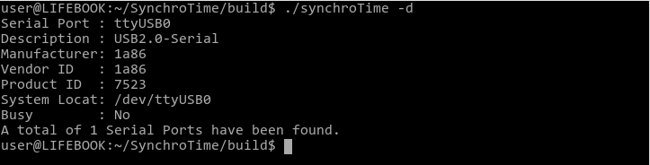

# SynchroTime - Console client for setting the time and calibrating the RTC DS3231 module

## About

 * Console application is used for fine tuning and calibration of the [RTC DS3231](https://create.arduino.cc/projecthub/MisterBotBreak/how-to-use-a-real-time-clock-module-ds3231-bc90fe) module.
 * And also for saving the parameters and calibration data in the energy-independent flash memory of the AT24C256 chip.
 * The client communicates with the Precision RTC DS3231 module via the serial interface (Serial Port).
 * The application allows you to:
   * Synchronize RTC DS3231 with computer time;
   * Correct the DS3231 RTC clock drift. The algorithm performs correction in the range from -12.8 to +12.7 ppm;
   * Automatically save parameters and calibration data to energy independent memory. In case there is a power failure to the module.
 * .
`
~$ ./synchroTime -h
`

## Using the app

 * Connect your Arduino to your computer via a free USB port. If there is a necessary driver in the system, a virtual device - Serial port will appear in the system (under Linux it will be /dev/ttyUSBx, under Windows - COMx).
 To find a new port, you can view the entire list of ports in the system with the discovery command. To do this, call the application with the -d (--discovery) switch:
 `
 ~$ ./synchroTime -d
 ``

 
 * 
