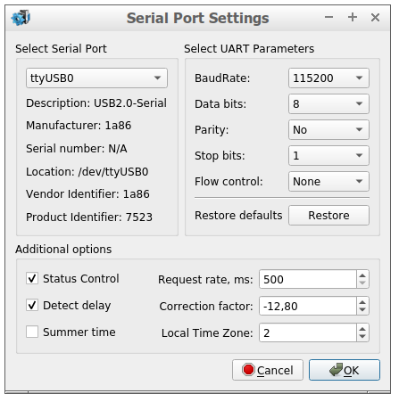

# SynchroTime - CLI- and GUI-client for adjust the exact time and calibrating the RTC DS3231 modules
<p align="center">
	<a href="http://www.kernel.org" rel="nofollow">
		
	</a>
	<a href="https://www.wikipedia.org/wiki/Windows" rel="nofollow">
		
	</a>
	<a href="https://github.com/SergejBre/SynchroTime/releases">
		
	</a>
	<a href="https://github.com/SergejBre/SynchroTime/releases">
		
	</a>
	<a href="https://github.com/SergejBre/SynchroTime/issues">
		
	</a>
	<a href="https://sergejbre.github.io/SynchroTime/doc/html/index.html">
		
	</a>
	<a href="https://github.com/SergejBre/SynchroTime/blob/master/LICENSE">
		
	</a>
</p>


____

## Motivation
The real-time clock module on the [DS3231](https://create.arduino.cc/projecthub/MisterBotBreak/how-to-use-a-real-time-clock-module-ds3231-bc90fe) chip has proven itself well in work with microcontrollers Arduino, Raspberry Pi, etc. According to the declared specification, it is an extremely accurate RTC with a guaranteed accuracy ±2 ppm (from 0°C to +40°C), which translates into an error of just 1 minute over the course of a year under the worst case scenario. But a large number of modules on the market do not meet the accuracy declared by the manufacturer, which is undoubtedly upsetting. Nevertheless, the manufacturer has provided for the possibility of correcting the drift of the frequency, which is associated with the aging of the oscillator crystal in the range from -12.8 to +12.7 ppm. This correction value can be written to one of the registers on the DS3231 (see part [Discussion](#Discussion) for exact ppm values). In addition, the manufacturer has provided a the energy-independent flash memory AT24C256 in the module, into which calibration parameters and correction factors can be placed. The tool below can automatically calibrate the DS3231 module.
____

## Contents
* [About the app](#About-the-app)
* [Using the CLI app](#Using-the-CLI-app)
* [Using the GUI app](#Using-the-GUI-app)
* [Specification](#Specification)
* [Description of the request protocol](#Description-of-the-request-protocol)
  * [Protocol table](#Protocol-table)
* [System Requirements](#System-Requirements)
* [Installing the CLI and GUI apps](#Installing-the-CLI-and-GUI-apps)
  * [under the Linux](#under-the-Linux)
  * [under the Windows](#under-the-Windows)
* [Discussion](#Discussion)
* [Documentation](#Documentation)
* [Dependencies](#Dependencies)
* [Compilation under Linux](#Compilation-under-Linux)
* [Issues](#Issues)
  * [Request Failed](#Request-Failed)
* [License](#License)
____

## About the app
* CLI and GUI applications are used for fine adjust and calibrating the DS3231 RTC module.

* The application allows you to:
  * adjust the time of the RTC DS3231 with your computer time;
  * correct the frequency drift of the RTC DS3231. The algorithm performs correction in the range from -12.8 to +12.7 ppm.
  * The application allows you to evaluate the accuracy and reliability of the RTC oscillator for a particular sample, as well as the chances of successful correction in case of significant time drift;
  * automatically save parameters and calibration data to the energy-independent flash memory of the type AT24C256. In case there is a power failure to the module.
  * The application allows you to estimate the response delay over a serial port using a dynamic moving average method (Simple Moving Average).
  
* The interface and help system of the application are multilingual: English, German and Russian.

* Developed in pure Qt, no third party libraries.

* Cross-platform application implementation (Linux and Windows).

* The client communicates with the Arduino server via the serial interface (UART). The application allows you to easily select a serial port for communication with the server and save the port name in the program settings.

* Command Help `$ ./synchroTime -h`


[](#Contents)
____

## Using the CLI app
1. First, you need to upload the sketch to Arduino from the [arduino/synchro_RTC.ino](arduino/synchro_RTC.ino) project directory, if you have a **DS3231 ZS-042** module or [arduino/synchro_RTC_MINI.ino](arduino/synchro_RTC_MINI.ino), if you have a **DS3231 MINI** module, then connect the RTC DS3231 module according to the circuit shown in the part [Specification](#Specification).
 Connect your Arduino to your computer via a free USB port. If there is a necessary driver in the system, a new virtual serial port will appear in the system (under Linux it will be `/dev/ttyUSBx`, under Windows - `COMx`).
 To find the name of this port, call the application with the `-d (--discovery)` switch:
```
 $ ./synchroTime -d
 Serial Port : ttyUSB1
 Description : USB2.0-Serial
 Manufacturer: 1a86
 Vendor ID   : 1a86
 Product ID  : 7523
 System Locat: /dev/ttyUSB1
 Busy        : No
 
 Serial Port : ttyUSB0
 Description : USB2.0-Serial
 Manufacturer: 1a86
 Vendor ID   : 1a86
 Product ID  : 7523
 System Locat: /dev/ttyUSB0
 Busy        : No
 
 A total of 2 serial ports were found.
``` 
 And under the Windows OS
```
 C:\\SynchroTime\\build>synchroTime -d
 Serial Port : COM5
 Description : USB-SERIAL CH340
 Manufacturer: wch.cn
 Vendor ID   : 1a86
 Product ID  : 7523
 System Locat: \\\.\\COM5
 Busy        : No

 Serial Port : COM3
 Description : Agere Systems HDA Modem
 Manufacturer: Agere
 Vendor ID   : 11c1
 Product ID  : 1040
 System Locat: \\\.\\COM3
 Busy        : No

 A total of 2 serial ports were found.
``` 

2. To select a virtual Serial Port, enter its system name after the command `-p \<portName\>`. The app will automatically create a configuration file, and the next call will contact the selected port.
```
 $ ./synchroTime -p ttyUSB0
 Added new serial interface ttyUSB0. 
```
 And under the Windows OS
```
 C:\\SynchroTime\\build>synchroTime -p COM5
 Added new serial interface COM5.
``` 

3. Use the `-i (--information)` command to get the current information from the DS3231 module. If everything is connected correctly, then you will get the current time of both clocks, the difference between the clocks in milliseconds (with an accuracy of ±2 ms), the value written in the aging register and the calculated time drift value in ppm. If the aging register and time drift are zero, then the DS3231 has not yet been calibrated (see step 5.)
```
 $ ./synchroTime -i
 DS3231 clock time	1598896552596 ms: 31.08.2020 19:55:52.596
 System local time	1598896589772 ms: 31.08.2020 19:56:29.772
 Difference between	-37176 ms
 Offset reg. in ppm	0 ppm
 Time drift in ppm	-8.78162 ppm
 last adjust of time	1594663200000 ms: 13.07.2020 20:00:00.000 
```

4. To set the exact time, use the `-a (--adjust)` command. The module clock will be synchronized with the computer time with an accuracy of ±1 ms. After updating the time, the date of the time setting will be recorded in the module's memory, which will allow later to determine the exact drift of the clock time.
```
 $ ./synchroTime -a
 System local time	Mo. 31 Aug. 2020 20:02:52.000
 Request for adjustment completed successfully. 
```

5. To calibrate the clock of the DS3231 module, enter the `-c (--calibration)` command. For the successful execution of this procedure, the module must be activated (see point 4.) and it is necessary that enough time has passed so that the calculated value of the clock drift is well distinguishable from the rounding error (ca 55 hours or 2.3 days, see part [Discussion](#Discussion)). The algorithm of the program will calculate the amount of drift of the clock time and the correction factor, which will be written into the aging register. The clock time will also be updated. If the calibration is successful, the current time, drift and correction factor will be displayed, as in the screenshot.

⚠️ Note: This method is slow, but has the advantage of not requiring any manual effort other than setting and reading the clock. Letting it run quietly on a shelf for a day or two is pretty easy. It also means that the clock goes through many day/night cycles and is subject to temperature changes, so it helps measure the long-term stability of the clock.
```
 $ ./synchroTime -c
 System local time	Mo. 31 Aug. 2020 20:04:14.000
 Offset last value	0
 Time drift in ppm	-2.11938 ppm
 Offset new value	-21
 Request for calibration completed successfully. 
```

6. To reset the aging register to its default value and clear the module's memory of calibration data, enter the `-r (--reset)` command. The default value will be written to the register, and memory cells will be overwritten with bytes with `0xFF`.
```
 $ ./synchroTime -r

 Request for reset completed successfully. 
```

7. Use the `-s (--setreg)` command to add a new value (e.g. `-12.8`) to the aging register of the DS3231. The new value will overwrite the old register value. The result will be limited to the values 12.7 and -12.8. **Warning: it makes sense to do this operation only in case of resetting all calibration data (see step 6)**.
```
 $ ./synchroTime -s -12.8

 Request for SetRegister completed successfully. 
```

[](#Contents)
____

## Using the GUI app


All functionality is similar to the [CLI application](#Using-the-CLI-app) (see figure above). As an extra, there is the option of selecting the numerous Serial Port settings and three features: **Status Control**, **Detect Delay** and **Correction Factor**. The **Correction Factor** is described in detail in the [Discussion](#Discussion) part. **Status Control** is an additional functionality to monitor the connection with a device with a **Request Rate** (from 500 to 10000 ms). The **Detect Delay** feature allows you to display the approximate delay in the exchange of information with the device. For the exchange rate of 115200 baud and the exchange of three bytes with the Device, the delay usually should not exceed 3-4ms, i.e. one byte per ms (depends mainly on the driver used and the HW UART device). Both features can be deactivated.


[](#Contents)
____

## Specification
* The application allows you to adjust the time with an accuracy of ±1 ms (guaranteed only for the Linux OS) (*).

* The application allows you to control the time difference between the DS3231 module and the computer with an accuracy of ±2 ms (guaranteed only for the Linux OS) (*).

* The application allows you to calibrate the module clock within the range from -12.8 to +12.7 ppm.

* Calibration by Aging Register is stable over the operating temperature range from 0°C to +40°C (see part [Discussion](#Discussion)).

* The application communicates with the Arduino server through any virtual serial interface (UART). The recommended UART baud rate is 115200 bps. The recommended parameters for serial port are 8-N-1.

* The Arduino is in turn connected to the Precision RTC DS3231 module via the I²C-interface: A4 (SDA), A5 (SCL) pins (SDA - data line and SCL - clock line).

* The interrupt on the port D2 (or D3) serves to count milliseconds by the internal Arduino counter millis.

* The suggested connection to the DS3231 module is according to the Circuit below.


(*)⚠️ Please note that the reported accuracy depends on the specifications of your platform; not all systems are capable of providing 1 millisecond accuracy!

[](#Contents)
____

## Description of the request protocol
The computer is a client. The client is always the first to send a request. Upon receipt of each request, the microprocessor must send back the appropriate response.

Each request is as follows: `<@ req> <local time> or <value> [CRC]`,
where:
* `@` - mandatory start byte, sign for the beginning of the transfer (always equal to `0x40`, 1 byte),
* `req` - request from the set `{a, c, i, r, s, t}` (size 1 byte),
* `local time` - local computer time only for requests `a, c, i` (size 6 bytes),
* `value` - new value for the aging register only for request `s` (size 4 bytes),
* `CRC` - checksum (size 1 byte). The checksum is calculated as the sum of all bytes, starting from the first byte of the request command and ending with the last byte of data,
* `a` - time adjustment request,
* `c` - calibrating request,
* `i` - information request,
* `s` - set aging register request,
* `r` - reset request,
* `t` - status request.

### Protocol table
|Request Name   |Head|Request Data        |Size b|Expected response on request                   |
|---------------|----|--------------------|------|-----------------------------------------------|
|Time adjustment|`@a`|`<local time> [CRC]`|2+6+1 |`<successful/failed> [CRC]`                    |
|Calibrating    |`@c`|`<local time> [CRC]`|2+6+1 |`<old Val> <drift> <new Val> <succ/fail> [CRC]`|
|Information    |`@i`|`<local time> [CRC]`|2+6+1 |`<RTC time> <Val> <drift> <Last setTime> [CRC]`|
|Set Register   |`@s`|`<value> [CRC]`     |2+4+1 |`<successful/failed> [CRC]`                    |
|Reset          |`@r`|`[CRC]`             |2+1   |`<successful/failed> [CRC]`                    |
|Status         |`@t`|`[CRC]`             |2+1   |`<successful/failed> [CRC]`                    |

[](#Contents)
____

## System Requirements
For the synchroTime application to work properly, you must synchronize the system time using the Network Time Protocol (NTP). Only then can the stated calibration characteristics be guaranteed. A slight desynchronization of the PC system time with a nearest reference NTP time server is allowed (no more than 10 milliseconds). It is not necessary for the NTP service client (ntpd) to be enabled on your PC all the time, but the NTP service must be pre-started, synchronized and stable while testing the DS3231 module, as well as during module calibration. In between measurements, you can turn off the service if you want. The DS3231 module must have an uninterruptible power supply (3V battery) throughout the entire measurement and calibration interval.

### ntpd service
* Under Ubuntu/Debian Linux distributions, the **ntpd** service is installed by the following command
```
 $ sudo apt-get install ntp 
```

* Check the correct operation of the service ntpd by running the command
```
 $ ntpq -p
     remote           refid      st t when poll reach   delay   offset  jitter
==============================================================================
+gromit.nocabal. 131.188.3.222    2 u   64   64  377   27.218   -3.906   5.643
*www.kashra.com  .DCFa.           1 u    3   64  377   42.583   -5.584   4.940
+ext01.epiontis. 130.149.17.8     2 u    2   64  177   18.668   -7.450   5.801
+ntp1.hetzner.de 124.216.164.14   2 u   11   64  377   25.011   -5.987   6.489
+chilipepper.can 134.71.66.21     2 u   74   64  376   26.689   -5.881   4.974 
```
* The columns **delay**, **offset** and **jitter** show some timing values which are derived from the query results. In some versions of ntpq the last column is labeled **disp** (for dispersion) instead of **jitter**. All values are in in milliseconds (ms).
  * The **delay** value is derived from the roundtrip time of the queries.
  * The **offset** value shows the difference between the reference time and the system clock.
  * The **jitter** value indicates the magnitude of jitter between several time queries.

* Look for a table entry `*`: table values offset and jitter, they should be as minimal as possible `max|offset ± jitter|⩽10 ms`. If this is not the case, adjust the configuration file `/etc/ntp.conf` in which you enter the local time servers.  The addresses of the nearest NTP time reference servers for your region can be found on the [NTP Pool Project](https://www.ntppool.org) page.

### Chrony service
**Chrony** is an implementation of the Network Time Protocol (NTP). It's a replacement for the ntpd, which is a reference implementation of the NTP. It runs on Unix-like operating systems (including Linux and MacOS). It's the default NTP client and server in Red Hat Enterprise Linux 8 and SUSE Linux Enterprise Server 15, and available in many Linux distributions.

* Under Ubuntu/Debian Linux distributions, the **chrony** service is installed by the following command
```
 $ sudo apt install chrony
```
* Chrony setting. The NTP client needs to know which the reference NTP time servers it needs to contact to get the current time. We can specify the reference NTP time servers in the server or pool directive in the NTP configuration file. Usually the default configuration file is `/etc/chrony/chrony.conf` or `/etc/chrony.conf` depending on the version of the Linux distribution. To improve reliability, it is recommended that you specify at least three reference time servers. The addresses of the nearest NTP time reference servers for your region can be found on the [NTP Pool Project](https://www.ntppool.org/zone/europe) page.
The following lines are just an example taken from an Ubuntu 18.04 LTS server:
```
[...]
# About using servers from the NTP Pool Project in general see (LP: #104525).
# Approved by Ubuntu Technical Board on 2011-02-08.
# See http://www.pool.ntp.org/join.html for more information.
#pool ntp.ubuntu.com iburst maxsources 4
pool 0.de.pool.ntp.org iburst maxsources 2
pool 1.de.pool.ntp.org iburst maxsources 2
pool 2.de.pool.ntp.org iburst maxsources 2
pool 3.de.pool.ntp.org iburst maxsources 2
[...]
```
* Check the correct operation of the service chrony by running the command
```
 $ chronyc sourcestats
210 Number of sources = 8
Name/IP Address            NP  NR  Span  Frequency  Freq Skew  Offset  Std Dev
==============================================================================
217.79.179.106              6   4   86m     +0.462      0.779  -1029us   367us
144.76.59.37               13   7  103m     +0.318      0.339  +2752us   564us
94.16.114.254              12   7  189m     +0.165      0.180   +106us   476us
172.105.75.114              8   3  138m     +0.174      0.583  -1113us   756us
141.30.228.4                6   3  154m     +0.194      0.190  +3641us   198us
78.46.162.102              12   8  206m     +0.140      0.093  -1316us   280us
90.187.148.77              56  23  584m     -0.115      0.072  +2010us  1670us
131.188.3.220               9   6  137m     +0.222      0.402  -1656us   614us 
```
### windows time service
The OS Windows has its own specifics. Windows `W32tm` Time Service synchronizes time once a week, which is not enough for fine tuning and calibration. The optimal solution for OS Windows would be to install a new NTP time synchronization system service to replace the default W32Time service. As an example, you can use one of the advanced projects: [NTP for Windows](https://www.meinbergglobal.com/english/sw/ntp.htm).

[](#Contents)
____

## Installing the CLI and GUI apps

### under the Linux


* According to the working platform, download the appropriate archive with the app from [](https://github.com/SergejBre/SynchroTime/releases).
* Unpack it to your home directory with write access, as the application retains its settings
```
 # for CLI app
 $ tar -xvf SynchroTime_x86_64_linux_v1.1.0-beta.tar.xz -C ~/
 
 # for GUI app
 $ tar -xvf SynchroTime_x86_64_linux.tar.xz -C ~/
``` 
* Run the application according to the instructions in the section [Using the CLI app](#Using-the-CLI-app) or [Using the GUI app](#Using-the-GUI-app)
```
 # for CLI app
 $ cd SynchroTime
 SynchroTime$ ./synchroTime

 # for GUI app
 $ cd SynchroTime
 SynchroTime$ ./synchroTimeApp
``` 
### under the Windows

* You need to unpack the downloaded archive `SynchroTime_Win32.7z somewhere (eg., to the Desktop). Next, you need to create a shortcut for the synchroTimeApp.exe executable file in Explover. Then, in the folder that opens, right-click the application's shortcut and select **Properties**. Click the **Compatibility** tab. Here you can use the Use the Compatibility Troubleshooter button or do it yourself (choose Windows 7 compatibility).

[](#Contents)
____

## Discussion
DS3231 is an extremely accurate RTC with a guaranteed accuracy of 2 ppm (from 0°C to +40°C), which translates into an error of just 60 seconds over the course of a year under the worst case scenario.

While by default DS3231 is already very accurate, we can push its accuracy even higher by adjusting its aging register (8bit). This adjustment works by adding or subtracting the corresponding capacitance to or from the oscillator capacitor array. The adjustable range is represented as 2’s complement (-128 to 127) and each LSB change corresponds to ca 0.1 ppm of change in frequency (which translates into roughly between 0.002 to 0.003 Hz). So the overall adjustment range can be achieved programmatically is ca ±13 ppm.

In its default configuration, the TCXO frequency is adjusted every 64 seconds depending on the environmental temperature by switching in or switching out capacitance via an internal look-up table. By utilizing the aging register, we can further null out any remaining offset. The aging offset adjustment is independent of the automatic adjustment via temperature compensation.

The aging register is at address 0x10 and the valid values for the input parameter offset ranges from -128 to 127. By default, the offset value is 0.

Manipulation with the Aging Register within LBS values ​​affects the thermal stabilization of the oscillator. This is reflected in the graph from the DS3231 [datasheet](https://datasheets.maximintegrated.com/en/ds/DS3231.pdf) below. According to the curves of the dependences of Frequency Deviation on Temperature and LBS Values, it is seen that there is a stability interval where frequency deviation remains quite stable. This range is between 0°C and +40°C. And according to the [datasheet](https://datasheets.maximintegrated.com/en/ds/DS3231.pdf), at room temperature +25°C for each LSB change Aging Register corresponds approximately 0.1ppm Frequency Deviation (i.e. 1 ≈ 0.1ppm). We use this data in our further calculations.


⚠️ Note: If you look at the “FREQUENCY DEVIATION vs. TEMPERATURE vs. AGING VALUE” plot in the datasheet, you’ll see that the clock is calibrated to run within 2ppm across its full temperature range if the aging register is set to zero. But if you set the aging register to a non-zero value while it’s at a particular temperature, the performance of the clock may be improved at that specific temperature, but if the temperature changes the clock may behave significantly differently (particularly if the aging offset and temperature changes are large). However, if you’re tuning the clock for specific performance requirements within a narrow range of temperatures, such as 0°C to +40°C, the aging offset can be used to improve its performance.

Let's consider another related feature. Having a graph of the dependence of the Oscillator Frequency Deviation on the Aging Register Values, the user can independently enter the correction factor `k` into the calculation. By choosing this factor in an appropriate way, you can get a better approximation for calculating the new value of the Aging register `v` from the frequency deviation `Δf`, i.e.
```
v(Δf) = k * Δf,
```
which will be displayed in the parameter list under the name: `Corrected value***`. The last value can be entered into the Aging register manually, via Request: `Set Register <v>`.

A graph showing the approximate dependence of the Frequency Deviation on the Aging Register Values ​​is presented below:


[](#Contents)
____

## Documentation
[](https://sergejbre.github.io/SynchroTime/doc/html/index.html)

For the detailed API documentation, see [link](https://sergejbre.github.io/SynchroTime/doc/html/index.html). Documentation is produced by doxygen.

[](#Contents)
____

## Dependencies
| Name         | Version                           | Comment                                         |
|--------------|-----------------------------------|-------------------------------------------------|
| Qt lib 32bit | ⩾ 5.5.1/or ⩾ 5.12.11 for Win32/pe | Didn't test with older versions, but it may work|
| Qt lib 64bit | ⩾ 5.12.11                         | Didn't test with older versions, but it may work|
| C++ compiler | supporting C++11 (i.e. GCC-7.5.0) | resp MinGW32-7.3.0 for Win32/pe release         |
| Arduino IDE  | ⩾ 1.8.13                          | !Replace compilation flags from -Os to -O2 (*)  |
| RTC library  | ⩾ 1.13.0                          | Adafruit RTC library for Arduino [RTClib](https://github.com/adafruit/RTClib) |
| QCustomPlot  | ⩾ 2.1.0                           | [QCustomPlot](https://gitlab.com/DerManu/QCustomPlot) |

(*) To do this, you need to edit the `platform.txt` file, which is located in the following path `[directory of the installed Arduino IDE]/hardware/arduino/avr/platform.txt`, find and edit these lines:
```
...
# compiler.c.flags=-c -g -Os {compiler.warning_flags} -std=gnu11 -ffunction-sections -fdata-sections -MMD -flto -fno-fat-lto-objects
# compiler.c.elf.flags={compiler.warning_flags} -Os -g -flto -fuse-linker-plugin -Wl,--gc-sections
compiler.c.flags=-c -g -O2 {compiler.warning_flags} -std=gnu11 -ffunction-sections -fdata-sections -MMD -flto -fno-fat-lto-objects
compiler.c.elf.flags={compiler.warning_flags} -O2 -g -flto -fuse-linker-plugin -Wl,--gc-sections
...
# compiler.cpp.flags=-c -g -Os {compiler.warning_flags} -std=gnu++11 -fpermissive -fno-exceptions -ffunction-sections -fdata-sections -fno-threadsafe-statics -Wno-error=narrowing -MMD -flto
compiler.cpp.flags=-c -g -O2 {compiler.warning_flags} -std=gnu++11 -fpermissive -fno-exceptions -ffunction-sections -fdata-sections -fno-threadsafe-statics -Wno-error=narrowing -MMD -flto
```

Dependencies on Qt libraries in case of dynamic application build:
```
 $ ldd synchroTime
	libQt5SerialPort.so.5 => ./lib/libQt5SerialPort.so.5
	libQt5Core.so.5 => ./lib/libQt5Core.so.5
	...
	libicui18n.so.54 => ./lib/libicui18n.so.54
	libicuuc.so.54 => ./lib/libicuuc.so.54
	libicudata.so.54 => ./lib/libicudata.so.54
``` 

[](#Contents)
____

## Compilation under Linux


* `sudo apt-get install build-essential qt5-default qt5-qmake git`
* `git clone https://github.com/SergejBre/SynchroTime.git`
* `cd ./SynchroTime`
* `QT_SELECT=5 qmake SynchroTime.pro`
* `make && make clean`

[](#Contents)
____

## Issues
[](https://github.com/SergejBre/SynchroTime/issues)

### Request Failed
If an above-mentioned error message occurs during communication with the microcontroller, the following [report](https://github.com/SergejBre/SynchroTime/issues/1#issuecomment-907040118) may be helpful.

[](#Contents)
____

## License
[](LICENSE)
